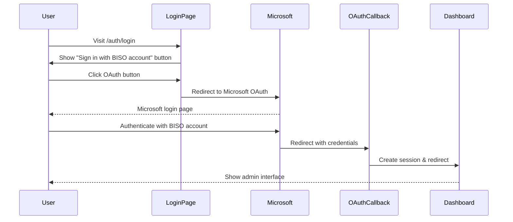

import { Callout } from 'components/callout';

# Authentication & Authorization

The admin app uses OAuth with Microsoft/Azure for authentication and role-based access control (RBAC) to restrict access to admin features.

<Callout type="info" title="OAuth Only">
The admin app uses OAuth with Microsoft/Azure (BISO accounts) for authentication. There is NO email/password login for administrators.
</Callout>

## Roles & Permissions

### Role Hierarchy

1. **Admin** - Full system access, can manage everything
2. **Editor** - Content management, cannot manage users or settings
3. **Viewer** - Read-only access to content

### Role Implementation

Roles are stored as labels in Appwrite user accounts:

```typescript
// Check if user has admin role
const user = await account.get();
const isAdmin = user.labels?.includes('admin');
const isEditor = user.labels?.includes('editor');
const hasAccess = isAdmin || isEditor;
```

## Authentication Flow



## Login Page

The login page offers a single authentication option - OAuth with Microsoft:

```typescript
// apps/admin/src/app/(auth)/auth/login/page.tsx
import { Login } from "@/components/login";
import { getAuthStatus } from "@/lib/auth-utils";
import { redirect } from "next/navigation";

export default async function Page({ searchParams }: { 
  searchParams: Promise<{ redirectTo?: string, error?: string }> 
}) {
  const authStatus = await getAuthStatus();
  const { error, redirectTo } = await searchParams;
  
  if (authStatus.isAuthenticated) {
    const target = redirectTo ? decodeURIComponent(redirectTo) : '/admin';
    return redirect(target);
  }
  
  return <Login />;
}
```

## OAuth Implementation

### Initiate OAuth Flow

**Server Action** (`apps/admin/src/lib/server.ts`):

```typescript
'use server';

import { createAdminClient } from '@repo/api/server';
import { headers } from 'next/headers';
import { OAuthProvider } from '@repo/api';
import { redirect } from 'next/navigation';

export async function signInWithAzure() {
  const { account } = await createAdminClient();
  const origin = (await headers()).get("origin");
  
  // Get redirect parameter from URL if exists
  const url = new URL((await headers()).get("referer") || `${origin}/auth/login`);
  const redirectTo = url.searchParams.get("redirectTo");
  
  // Include redirectTo in success URL
  const successUrl = redirectTo ? 
    `${origin}/auth/oauth?redirectTo=${redirectTo}` : 
    `${origin}/auth/oauth`;

  const redirectUrl = await account.createOAuth2Token(
    OAuthProvider.Microsoft,
    successUrl,
    `${origin}/auth/login`
  );

  return redirect(redirectUrl);
}
```

### Handle OAuth Callback

**OAuth Callback Route** (`apps/admin/src/app/(auth)/auth/oauth/route.ts`):

```typescript
import { createAdminClient } from "@repo/api/server";
import { cookies } from "next/headers";
import { NextRequest } from "next/server";
import { redirect } from "next/navigation";

export async function GET(request: NextRequest) {
  const userId = request.nextUrl.searchParams.get("userId");
  const secret = request.nextUrl.searchParams.get("secret");
  const redirectTo = request.nextUrl.searchParams.get("redirectTo");

  const { account } = await createAdminClient();
  const session = await account.createSession(userId, secret);

  (await cookies()).set("a_session_biso", session.secret, {
    path: "/",
    httpOnly: true,
    sameSite: "none",
    secure: true,
    domain: ".biso.no"
  });

  // Redirect to original destination or admin dashboard
  if (redirectTo) {
    return redirect(decodeURIComponent(redirectTo));
  }

  return redirect(`/admin`);
}
```

## Middleware Protection

```typescript
// middleware.ts
import { createSessionClient } from '@repo/api/server';
import { NextResponse } from 'next/server';
import type { NextRequest } from 'next/server';

export async function middleware(request: NextRequest) {
  const { pathname } = request.nextUrl;
  
  // Protect admin routes
  if (pathname.startsWith('/admin')) {
    try {
      const { account } = await createSessionClient();
      const user = await account.get();
      
      // Verify user has required role
      const hasAccess = user.labels?.includes('admin') || 
                        user.labels?.includes('editor');
      
      if (!hasAccess) {
        return NextResponse.redirect(new URL('/unauthorized', request.url));
      }
    } catch {
      return NextResponse.redirect(new URL('/auth/login', request.url));
    }
  }
  
  return NextResponse.next();
}

export const config = {
  matcher: ['/admin/:path*'],
};
```

## Permission Checks in Components

```typescript
// components/admin/delete-button.tsx
'use client';

import { useUser } from '@/hooks/use-user';
import { Button } from '@repo/ui/components/ui/button';

export function DeleteButton({ onDelete }: { onDelete: () => void }) {
  const { user } = useUser();
  
  // Only admins can delete
  if (!user?.labels?.includes('admin')) {
    return null;
  }
  
  return (
    <Button variant="destructive" onClick={onDelete}>
      Delete
    </Button>
  );
}
```

## Role Assignment

Admins can assign roles to users:

```typescript
// app/actions/users.ts
'use server';

import { createAdminClient } from '@repo/api/server';

export async function assignRole(userId: string, role: 'admin' | 'editor' | 'viewer') {
  const { account } = await createAdminClient();
  
  // Verify current user is admin
  const currentUser = await account.get();
  if (!currentUser.labels?.includes('admin')) {
    return {
      success: false,
      error: 'Unauthorized: Only admins can assign roles'
    };
  }
  
  // Update user labels
  await account.updateLabels(userId, [role]);
  
  return { success: true };
}
```

<Callout type="warning" title="Security">
Always verify permissions on the server. Client-side checks are for UX only - never rely on them for security.
</Callout>

## Session Management

Sessions are stored in HTTP-only cookies with domain-wide access:

```typescript
cookies().set("a_session_biso", session.secret, {
  path: "/",
  httpOnly: true,
  sameSite: "none",
  secure: true,
  domain: ".biso.no"  // Domain-wide cookie
});
```

## Related Documentation

- [User Management](/docs/admin-app/user-management) - Managing users and roles
- [@repo/api Package](/docs/packages/api/overview) - Appwrite client
- [Authentication Guide](/docs/development/guides/authentication) - General auth patterns

