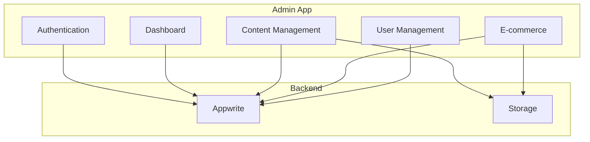

import { Callout } from 'components/callout';

# Admin App Overview

The BISO Sites Admin App is a comprehensive content management system (CMS) that enables administrators and editors to manage all aspects of the organization's digital presence.

## Purpose & Features

The Admin App provides tools for:

1. **User Management** - Manage users, roles, and permissions
2. **Content Management** - Create and edit posts, news, pages
3. **Event Management** - Manage events, registrations, attendance
4. **E-commerce Management** - Products, orders, customers
5. **Department Management** - Units, teams, content
6. **Job Board** - Job postings and applications
7. **Expense System** - Internal expense tracking
8. **Page Builder** - Visual page editor with Puck

## Technology Stack

- **Next.js 15** - App Router
- **React 19** - Server Components
- **TypeScript** - Type safety
- **Tail wind CSS** - Styling
- **Appwrite** - Backend (database, auth, storage)
- **Puck** - Visual page builder
- **@repo/ui** - Shared UI components

## Architecture



## Directory Structure

```
apps/admin/src/
├── app/
│   ├── (admin)/
│   │   └── admin/            # Protected admin routes
│   │       ├── page.tsx      # Dashboard
│   │       ├── users/        # User management
│   │       ├── posts/        # News/posts
│   │       ├── events/       # Events
│   │       ├── pages/        # Page builder
│   │       ├── shop/         # E-commerce
│   │       ├── units/        # Departments
│   │       ├── jobs/         # Job board
│   │       └── expenses/     # Expense system
│   ├── (auth)/               # Login routes
│   └── actions/              # Server actions
├── components/               # Admin components
└── lib/                      # Utilities
```

## Authentication & Authorization

### Role-Based Access Control

The admin app uses three primary roles:

1. **Admin** - Full access to all features
2. **Editor** - Content management access
3. **Viewer** - Read-only access

```typescript
// Middleware protection
export async function middleware(request: NextRequest) {
  const { pathname } = request.nextUrl;
  
  if (pathname.startsWith('/admin')) {
    const { account } = await createSessionClient();
    
    try {
      const user = await account.get();
      
      // Check if user has admin role
      if (!user.labels?.includes('admin') && !user.labels?.includes('editor')) {
        return NextResponse.redirect(new URL('/unauthorized', request.url));
      }
    } catch {
      return NextResponse.redirect(new URL('/auth/login', request.url));
    }
  }
  
  return NextResponse.next();
}
```

## Dashboard

**Route**: `/admin`  
**File**: `app/(admin)/admin/page.tsx`

The dashboard provides an overview of:
- Recent activity
- Pending registrations
- Order statistics
- User statistics
- Quick actions

```typescript
// app/(admin)/admin/page.tsx
import { createSessionClient } from '@repo/api/server';
import { StatsCards } from '@/components/dashboard/stats-cards';
import { RecentActivity } from '@/components/dashboard/recent-activity';

export default async function AdminDashboard() {
  const { db } = await createSessionClient();
  
  // Fetch dashboard data
  const stats = await getDashboardStats(db);
  const recentActivity = await getRecentActivity(db);
  
  return (
    <div className="space-y-8">
      <h1 className="text-3xl font-bold">Dashboard</h1>
      <StatsCards stats={stats} />
      <RecentActivity activities={recentActivity} />
    </div>
  );
}
```

## Key Features at a Glance

### User Management

- User listing with search and filters
- User profile editing
- Role assignment
- Invitation system
- Activity tracking

### Content Management

- **Posts/News** - Rich text editor, image uploads, publishing
- **Events** - Event editor with preview, registration tracking
- **Pages** - Visual page builder with Puck

### E-commerce Management

- **Products** - Product editor with variations, images
- **Orders** - Order tracking, status updates
- **Customers** - Customer management
- **Settings** - Shop configuration

### Other Features

- **Units** - Department management
- **Jobs** - Job posting and application tracking
- **Expenses** - Internal expense approval system

## Navigation

The admin app uses a sidebar navigation layout:

```typescript
// components/layout/admin-sidebar.tsx
export function AdminSidebar() {
  return (
    <aside className="w-64 border-r">
      <nav className="space-y-2 p-4">
        <SidebarLink href="/admin" icon={Home}>
          Dashboard
        </SidebarLink>
        <SidebarLink href="/admin/users" icon={Users}>
          Users
        </SidebarLink>
        <SidebarLink href="/admin/posts" icon={FileText}>
          Posts
        </SidebarLink>
        <SidebarLink href="/admin/events" icon={Calendar}>
          Events
        </SidebarLink>
        <SidebarLink href="/admin/pages" icon={Layout}>
          Pages
        </SidebarLink>
        <SidebarLink href="/admin/shop" icon={ShoppingCart}>
          Shop
        </SidebarLink>
        <SidebarLink href="/admin/units" icon={Building}>
          Units
        </SidebarLink>
        <SidebarLink href="/admin/jobs" icon={Briefcase}>
          Jobs
        </SidebarLink>
      </nav>
    </aside>
  );
}
```

## Environment Variables

```bash
# Appwrite
NEXT_PUBLIC_APPWRITE_PROJECT_ID=your_project_id
NEXT_PUBLIC_APPWRITE_ENDPOINT=https://cloud.appwrite.io/v1
APPWRITE_API_KEY=your_admin_api_key

# Application
NEXT_PUBLIC_BASE_URL=http://localhost:3001
```

## Port Configuration

- **Development**: `http://localhost:3001`
- **Production**: Configured via hosting

## Quick Start

```bash
cd apps/admin
bun install
bun run dev
# Visit http://localhost:3001
```

## Related Documentation

- [Authentication](/docs/admin-app/auth) - Auth flows and roles
- [Content Management](/docs/admin-app/content-management/posts) - Managing content
- [User Management](/docs/admin-app/user-management) - Managing users
- [Shop Management](/docs/admin-app/shop/products) - E-commerce admin
- [@repo/editor Package](/docs/packages/editor/overview) - Page builder

