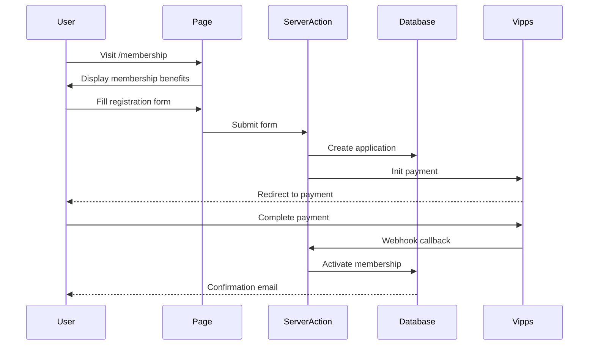

import { Callout } from 'components/callout';
import { Steps, Step } from 'components/steps';

# Membership Feature

The membership system allows students and supporters to become members of BISO Sites, providing access to exclusive benefits, events, and resources.

## Overview

The membership feature handles:

- **Member Registration** - Collect member information and preferences
- **Payment Integration** - Process membership fees via Vipps
- **Member Dashboard** - View membership status and benefits
- **Automatic Renewals** - Track membership periods and renewals

## User Flow



## Implementation

### Membership Page

**File**: `app/(public)/membership/page.tsx`

```typescript
// app/(public)/membership/page.tsx
import { MembershipPageClient } from './membership-page-client';
import { getMembershipBenefits } from 'app/actions/membership';

export default async function MembershipPage() {
  const benefits = await getMembershipBenefits();
  
  return <MembershipPageClient benefits={benefits} />;
}
```

### Client Component

**File**: `app/(public)/membership/membership-page-client.tsx`

```typescript
// app/(public)/membership/membership-page-client.tsx
'use client';

import { useState } from 'react';
import { useTranslations } from 'next-intl';
import { MembershipForm } from '@/components/forms/membership-form';
import { BenefitsSection } from '@/components/membership/benefits';

export function MembershipPageClient({ benefits }) {
  const t = useTranslations('membership');
  
  return (
    <div className="container py-12">
      <section className="mb-12">
        <h1 className="text-4xl font-bold mb-4">
          {t('title')}
        </h1>
        <p className="text-xl text-muted-foreground">
          {t('description')}
        </p>
      </section>
      
      <BenefitsSection benefits={benefits} />
      
      <section className="max-w-2xl mx-auto mt-12">
        <h2 className="text-2xl font-bold mb-6">
          {t('registerTitle')}
        </h2>
        <MembershipForm />
      </section>
    </div>
  );
}
```

### Membership Form

```typescript
// components/forms/membership-form.tsx
'use client';

import { useActionState } from 'react';
import { submitMembershipApplication } from 'app/actions/membership';
import { Input } from '@repo/ui/components/ui/input';
import { Button } from '@repo/ui/components/ui/button';
import { Select } from '@repo/ui/components/ui/select';

export function MembershipForm() {
  const [state, formAction, isPending] = useActionState(
    submitMembershipApplication,
    { success: false }
  );
  
  return (
    <form action={formAction} className="space-y-6">
      <div className="grid md:grid-cols-2 gap-4">
        <div>
          <label htmlFor="firstName">First Name *</label>
          <Input 
            id="firstName" 
            name="firstName" 
            required 
          />
        </div>
        
        <div>
          <label htmlFor="lastName">Last Name *</label>
          <Input 
            id="lastName" 
            name="lastName" 
            required 
          />
        </div>
      </div>
      
      <div>
        <label htmlFor="email">Email *</label>
        <Input 
          id="email" 
          name="email" 
          type="email" 
          required 
        />
      </div>
      
      <div>
        <label htmlFor="phone">Phone *</label>
        <Input 
          id="phone" 
          name="phone" 
          type="tel" 
          required 
        />
      </div>
      
      <div>
        <label htmlFor="studentId">Student ID (optional)</label>
        <Input 
          id="studentId" 
          name="studentId" 
        />
      </div>
      
      <div>
        <label htmlFor="campus">Campus *</label>
        <Select name="campus" required>
          <option value="">Select campus</option>
          <option value="oslo">Oslo</option>
          <option value="bergen">Bergen</option>
          <option value="trondheim">Trondheim</option>
        </Select>
      </div>
      
      {state.error && (
        <div className="p-4 bg-red-50 text-red-700 rounded">
          {state.error}
        </div>
      )}
      
      {state.success && (
        <div className="p-4 bg-green-50 text-green-700 rounded">
          Application submitted! Redirecting to payment...
        </div>
      )}
      
      <Button 
        type="submit" 
        disabled={isPending}
        className="w-full"
      >
        {isPending ? 'Submitting...' : 'Continue to Payment'}
      </Button>
    </form>
  );
}
```

### Server Action

```typescript
// app/actions/membership.ts
'use server';

import { createSessionClient } from '@repo/api/server';
import { createCheckoutSession } from '@repo/payment';
import { revalidatePath } from 'next/cache';
import { redirect } from 'next/navigation';
import { z } from 'zod';

const membershipSchema = z.object({
  firstName: z.string().min(1, 'First name is required'),
  lastName: z.string().min(1, 'Last name is required'),
  email: z.string().email('Invalid email address'),
  phone: z.string().min(8, 'Phone number must be at least 8 digits'),
  studentId: z.string().optional(),
  campus: z.enum(['oslo', 'bergen', 'trondheim'], {
    errorMap: () => ({ message: 'Please select a campus' })
  }),
});

export async function submitMembershipApplication(
  prevState: unknown,
  formData: FormData
) {
  try {
    // 1. Validate form data
    const validated = membershipSchema.parse({
      firstName: formData.get('firstName'),
      lastName: formData.get('lastName'),
      email: formData.get('email'),
      phone: formData.get('phone'),
      studentId: formData.get('studentId'),
      campus: formData.get('campus'),
    });
    
    // 2. Create database entry
    const { db } = await createSessionClient();
    
    const application = await db.createDocument(
      process.env.NEXT_PUBLIC_APPWRITE_DATABASE_ID!,
      'membership_applications',
      'unique()',
      {
        ...validated,
        status: 'pending_payment',
        submittedAt: new Date().toISOString(),
      }
    );
    
    // 3. Create payment session
    const checkoutUrl = await createCheckoutSession({
      orderId: application.$id,
      amount: 200, // 200 NOK membership fee
      description: 'BISO Sites Membership',
      returnUrl: `${process.env.NEXT_PUBLIC_BASE_URL}/membership/confirm`,
    });
    
    // 4. Redirect to payment
    redirect(checkoutUrl);
  } catch (error) {
    if (error instanceof z.ZodError) {
      return {
        success: false,
        error: error.errors[0].message,
      };
    }
    
    console.error('Membership application failed:', error);
    return {
      success: false,
      error: 'Failed to submit application. Please try again.',
    };
  }
}

export async function getMembershipBenefits() {
  const { db } = await createSessionClient();
  
  const benefits = await db.listDocuments(
    process.env.NEXT_PUBLIC_APPWRITE_DATABASE_ID!,
    'membership_benefits'
  );
  
  return benefits.documents;
}
```

## Benefits Section

```typescript
// components/membership/benefits.tsx
import { Card, CardHeader, CardTitle, CardContent } from '@repo/ui/components/ui/card';

interface Benefit {
  title: string;
  description: string;
  icon: string;
}

export function BenefitsSection({ benefits }: { benefits: Benefit[] }) {
  return (
    <section>
      <h2 className="text-3xl font-bold mb-8 text-center">
        Member Benefits
      </h2>
      
      <div className="grid md:grid-cols-3 gap-6">
        {benefits.map((benefit, index) => (
          <Card key={index}>
            <CardHeader>
              <div className="text-4xl mb-2">{benefit.icon}</div>
              <CardTitle>{benefit.title}</CardTitle>
            </CardHeader>
            <CardContent>
              <p className="text-muted-foreground">
                {benefit.description}
              </p>
            </CardContent>
          </Card>
        ))}
      </div>
    </section>
  );
}
```

## Payment Webhook Handler

```typescript
// app/api/checkout/webhook/route.ts
import { createAdminClient } from '@repo/api/server';

export async function POST(request: Request) {
  const payload = await request.json();
  const { orderId, status } = payload;
  
  if (status === 'PAID') {
    const { db } = await createAdminClient();
    
    // Update membership application to active
    await db.updateDocument(
      process.env.NEXT_PUBLIC_APPWRITE_DATABASE_ID!,
      'membership_applications',
      orderId,
      {
        status: 'active',
        activatedAt: new Date().toISOString(),
        expiresAt: new Date(
          Date.now() + 365 * 24 * 60 * 60 * 1000
        ).toISOString(), // 1 year from now
      }
    );
    
    // TODO: Send confirmation email
  }
  
  return Response.json({ success: true });
}
```

## Member Dashboard

For authenticated members to view their membership status:

```typescript
// app/(protected)/profile/page.tsx
import { createSessionClient } from '@repo/api/server';
import { MembershipStatusCard } from '@/components/profile/membership-status-card';

export default async function ProfilePage() {
  const { account, db } = await createSessionClient();
  const user = await account.get();
  
  // Get member's active membership
  const memberships = await db.listDocuments(
    process.env.NEXT_PUBLIC_APPWRITE_DATABASE_ID!,
    'membership_applications',
    [
      Query.equal('email', user.email),
      Query.equal('status', 'active'),
    ]
  );
  
  const membership = memberships.documents[0];
  
  return (
    <div>
      <h1>My Profile</h1>
      <MembershipStatusCard membership={membership} />
    </div>
  );
}
```

## Database Schema

The membership system uses these Appwrite collections:

### membership_applications

```json
{
  "firstName": "string",
  "lastName": "string",
  "email": "string (email)",
  "phone": "string",
  "studentId": "string (optional)",
  "campus": "enum (oslo, bergen, trondheim)",
  "status": "enum (pending_payment, active, expired, cancelled)",
  "submittedAt": "datetime",
  "activatedAt": "datetime",
  "expiresAt": "datetime"
}
```

### membership_benefits

```json
{
  "title": "string",
  "description": "string",
  "icon": "string",
  "order": "integer"
}
```

## Internationalization

All membership text is translated:

```json
// messages/en/membership.json
{
  "title": "Become a Member",
  "description": "Join thousands of students at BISO Sites",
  "registerTitle": "Register Now",
  "benefits": {
    "events": "Access to exclusive events",
    "discounts": "Member discounts in shop",
    "community": "Connect with fellow students"
  }
}
```

## Related Documentation

- [Payment Package](/docs/packages/payment/overview) - Vipps integration
- [Forms Guide](/docs/development/guides/forms) - Form handling patterns
- [Server Actions](/docs/applications/web-app/server-actions) - Data mutations
- [Authentication](/docs/development/guides/authentication) - User authentication

## Best Practices

<Callout type="success" title="Membership Best Practices">
1. **Validate all input** - Use Zod for comprehensive validation
2. **Handle payment failures** - Gracefully handle declined payments
3. **Send confirmation emails** - Keep members informed
4. **Track expiration** - Set up automated renewal reminders
5. **Secure member data** - Follow GDPR compliance
6. **Test payment flow** - Use Vipps test environment
</Callout>

