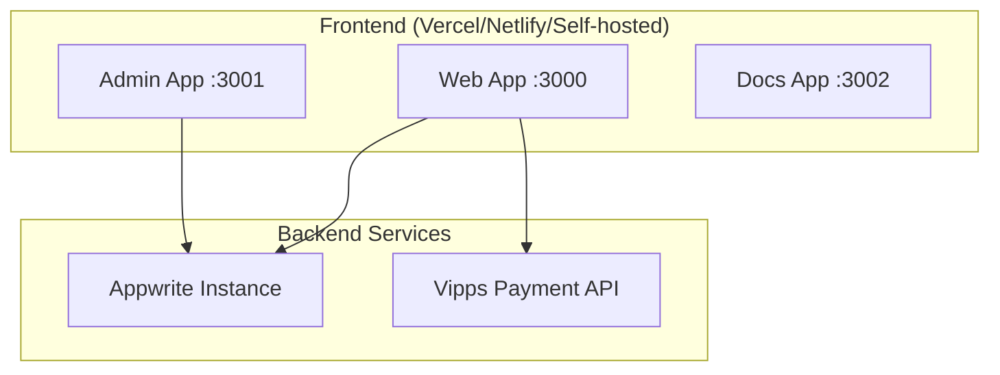

import { Callout } from 'components/callout';

# Deployment Overview

BISO Sites is a Next.js monorepo with three main applications (web, admin, docs) that can be deployed independently or together.

## Applications

1. **Web App** (port 3000) - Public-facing website
2. **Admin App** (port 3001) - Content management system
3. **Docs App** (port 3002) - Documentation site

## Infrastructure Requirements

- **Node.js**: >= 18.x
- **Bun**: >= 1.3.x (recommended)
- **Database**: Appwrite (self-hosted or cloud)
- **Storage**: Appwrite Storage for images/files
- **Payment**: Vipps account for Norwegian payments

## Deployment Architecture



## Build Commands

```bash
# Install dependencies
bun install

# Build all apps
bun run build

# Build specific app
bun run build --filter=web
bun run build --filter=admin
bun run build --filter=docs
```

## Deployment Options

### Option 1: Vercel (Recommended)

1. Connect GitHub repository
2. Configure build settings per app
3. Set environment variables
4. Deploy

### Option 2: Docker

See [Docker Guide](/docs/repository/deployment/docker) for containerized deployment.

### Option 3: Self-Hosted

```bash
# Build production
bun run build --filter=web

# Start production server
cd apps/web
bun run start
```

## Environment Variables

Each app requires specific environment variables. See [Environment Variables Guide](/docs/repository/deployment/environment-variables).

## Related Documentation

- [Environment Variables](/docs/repository/deployment/environment-variables)
- [Docker Deployment](/docs/repository/deployment/docker)
- [Appwrite Setup](/docs/repository/deployment/appwrite-setup)

