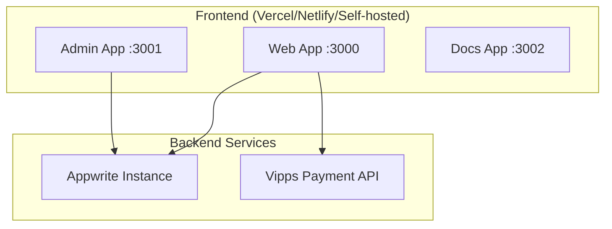

import { Callout } from 'components/callout';
import { Steps, Step } from 'components/steps';

# Operations Overview

BISO Sites is a Next.js monorepo with three main applications (web, admin, docs) that can be deployed independently or together.

## Who owns operations?

<Callout type="info">
Typically the IT Manager (or equivalent) is the primary owner, but always name a backup. Both people should have access to Appwrite, hosting, Vipps, and any secret vaults.
</Callout>

## Operations playbook

<Steps>
  <Step title="Prepare changes">
    Run `bun run lint`, `bun run check-types`, and `bun run build` for the app you are touching. Capture screenshots for UI changes (required for PRs).
  </Step>
  <Step title="Update infrastructure">
    - Vercel: push to `main` or trigger a deploy.  
    - Docker/self-hosted: rebuild images (`docker compose build`) and restart the stack.  
    - Appwrite: deploy new collections or indexes before shipping code that depends on them.
  </Step>
  <Step title="Verify critical flows">
    Open web (`/events`, `/shop`, `/membership`) and admin (`/admin`, `/admin/orders`) routes. Place a Vipps test order when touching payments.
  </Step>
  <Step title="Monitor + rollback">
    Tail application logs (`bun run start` output or `docker logs`). For regressions, revert the commit or redeploy the previous image tag noted in your deploy log.
  </Step>
</Steps>

## Applications

1. **Web App** (port 3000) - Public-facing website
2. **Admin App** (port 3001) - Content management system
3. **Docs App** (port 3002) - Documentation site

## Infrastructure Requirements

- **Node.js**: >= 18.x
- **Bun**: >= 1.3.x (recommended)
- **Database**: Appwrite (self-hosted or cloud)
- **Storage**: Appwrite Storage for images/files
- **Payment**: Vipps account for Norwegian payments

## Deployment Architecture



## Build Commands

```bash
# Install dependencies
bun install

# Build all apps
bun run build

# Build specific app
bun run build --filter=web
bun run build --filter=admin
bun run build --filter=docs
```

## Deployment Options

### Option 1: Vercel (Recommended)

1. Connect GitHub repository
2. Configure build settings per app
3. Set environment variables
4. Deploy

### Option 2: Docker

See [Docker Guide](/docs/operations/docker) for containerized deployment.

### Option 3: Self-Hosted

```bash
# Build production
bun run build --filter=web

# Start production server
cd apps/web
bun run start
```

## Environment Variables

Each app requires specific environment variables. See [Environment Variables Guide](/docs/operations/environment-variables).

## Incident response basics

- **Payments down?** Disable checkout CTA in the admin shop and post a banner in the web app. Check Vipps status and Appwrite logs.
- **Appwrite unavailable?** Switch web/admin apps to maintenance mode (show static page) and notify the student union leadership.
- **Deployment failed?** Roll back to the previous Vercel deployment or Docker image tag, then investigate in a separate branch.

## Weekly checklist

- ✅ Review Appwrite health and usage metrics.
- ✅ Rotate any expiring secrets (Vipps subscription key, API keys).
- ✅ Skim error logs (Vercel, Docker, or Bun output) for recurring issues.
- ✅ Update this documentation if you changed infrastructure steps.

## Related Documentation

- [Environment Variables](/docs/operations/environment-variables)
- [Docker Deployment](/docs/operations/docker)
- [Appwrite Setup](/docs/operations/appwrite-setup)
- [Vipps Playbook](/docs/operations/vipps)

