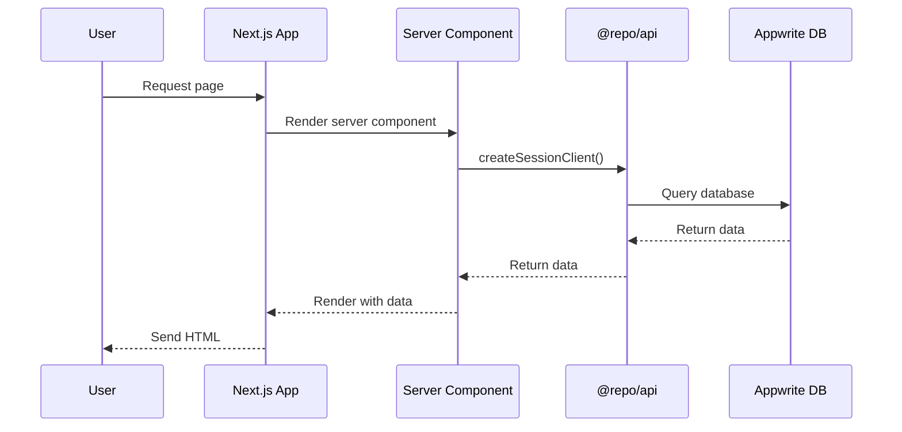
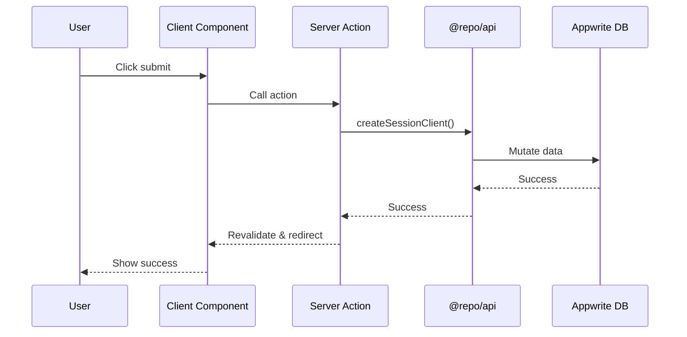
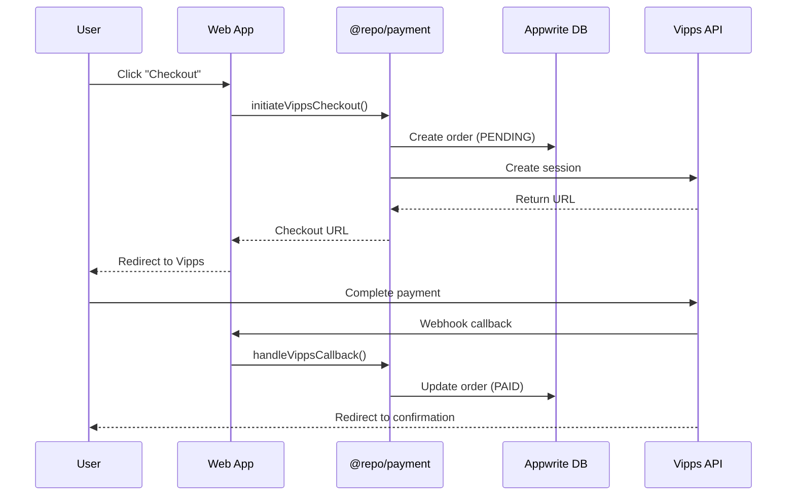
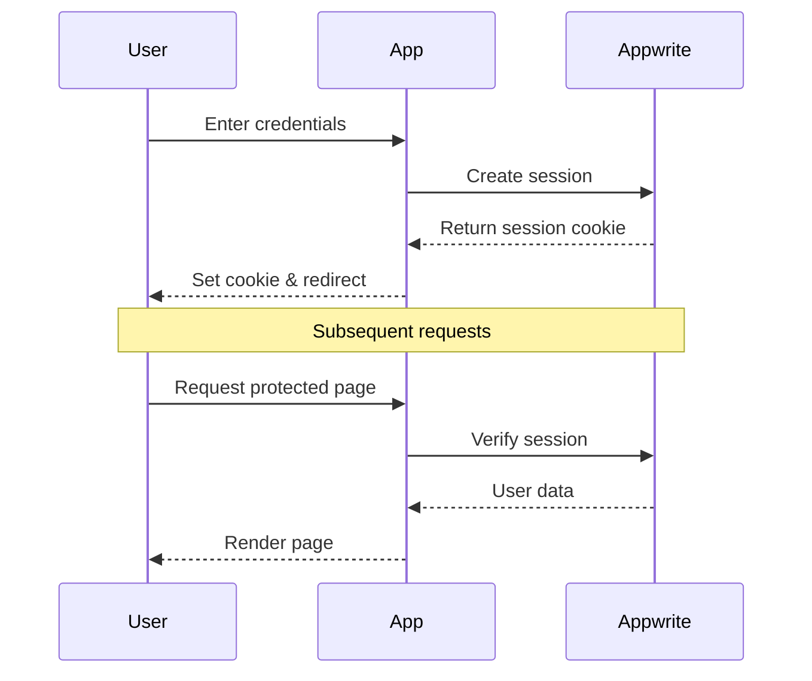
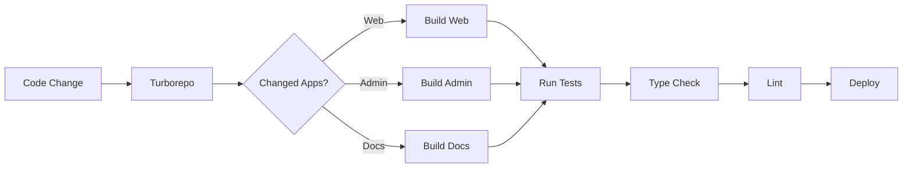

import { Callout } from 'components/callout';

# Architecture Overview

This document provides a high-level overview of the BISO Sites monorepo architecture, explaining how all the pieces fit together and why certain architectural decisions were made.

## System Architecture

BISO SItes is built as a **monorepo** containing multiple applications that share common packages. The architecture follows these key principles:

1. **Separation of Concerns** - Clear boundaries between applications and packages
2. **Code Reusability** - Shared packages eliminate duplication
3. **Type Safety** - Full TypeScript coverage across all code
4. **Framework Agnostic Packages** - Packages don't depend on Next.js runtime
5. **Scalability** - Can add new apps and packages easily

### High-Level Diagram

```mermaid
graph TB
    subgraph "Frontend Applications"
        WEB[Web App :3000<br/>Public Website]
        ADMIN[Admin App :3001<br/>CMS]
        DOCS[Docs App :3002<br/>Documentation]
    end
    
    subgraph "Shared Packages"
        API[[@repo/api<br/>Appwrite Clients]]
        UI[[@repo/ui<br/>Component Library]]
        EDITOR[[@repo/editor<br/>Page Builder]]
        PAYMENT[[@repo/payment<br/>Payment Processing]]
    end
    
    subgraph "Backend Services"
        APPWRITE[(Appwrite<br/>Database, Auth, Storage)]
        VIPPS[Vipps API<br/>Payment Gateway]
    end
    
    WEB --> API
    WEB --> UI
    WEB --> EDITOR
    WEB --> PAYMENT
    
    ADMIN --> API
    ADMIN --> UI
    ADMIN --> EDITOR
    ADMIN --> PAYMENT
    
    DOCS --> UI
    
    API --> APPWRITE
    PAYMENT --> VIPPS
    PAYMENT --> API
    EDITOR --> UI
```

## Layer Architecture

The system is organized into distinct layers:

### Presentation Layer (Apps)

**Responsibility:** User interface and user interactions

- **Web App** - Public-facing UI for end users
- **Admin App** - Management interface for content creators
- **Docs App** - Documentation for developers

**Technologies:**
- Next.js 15 App Router
- React 19
- Server Components & Server Actions
- next-intl for i18n

### Business Logic Layer (Packages)

**Responsibility:** Reusable business logic and utilities

- **@repo/api** - Appwrite API wrappers
- **@repo/payment** - Payment processing logic
- **@repo/editor** - Page builder configuration

**Key Principle:** Framework-agnostic, testable, pure TypeScript

### Presentation Components Layer (@repo/ui)

**Responsibility:** Reusable UI components

- shadcn/ui components
- Custom composite components
- Theme provider
- Styling utilities

**Technology:** React + Tailwind CSS

### Infrastructure Layer (Backend)

**Responsibility:** Data persistence, authentication, file storage

- **Appwrite** - Primary backend
  - Database (NoSQL/Document)
  - Authentication & Authorization
  - File Storage
  - Real-time subscriptions
  
- **External Services**
  - Vipps MobilePay (payments)
  - OpenAI API (AI features in admin)

## Architectural Patterns

### 1. Monorepo Pattern

**Why Monorepo?**

✅ **Benefits:**
- Share code between apps without publishing packages
- Single version of dependencies across all apps
- Atomic commits across multiple apps
- Consistent tooling and configuration
- Easy to refactor across boundaries

❌ **Challenges:**
- Larger repository size
- Need proper build orchestration (solved with Turborepo)

**Implementation:**
- Turborepo for build orchestration
- Bun workspaces for dependency management
- Shared tsconfig and eslint configs

### 2. Dependency Injection Pattern

Used in the payment package to keep it framework-agnostic.

**Before (❌ Tight Coupling):**
```typescript
// packages/payment/vipps.ts
import { createSessionClient } from '@repo/api/server'; // Next.js dependency!

export async function createCheckout(params) {
  const { db } = await createSessionClient(); // Importing Next.js runtime
  // ... logic
}
```

**After (✅ Dependency Injection):**
```typescript
// packages/payment/vipps.ts
// No Next.js imports - framework agnostic!

export async function createCheckout(params, db) {
  // db is passed as parameter
  // ... logic
}
```

**Benefits:**
- Package can be used in any Node.js environment
- Easy to test (mock the db)
- Clear dependencies
- Follows SOLID principles

See [Dependency Injection](/docs/architecture/dependency-injection) for full details.

### 3. Server-First Architecture

Leveraging Next.js App Router's server-first approach:

**Server Components (Default):**
- Fast initial page load
- SEO friendly
- Direct database access
- Reduced client bundle size

**Client Components (When Needed):**
- Interactivity (onClick, useState, etc.)
- Browser APIs
- Third-party libraries that need window/document

**Server Actions:**
- Type-safe mutations
- No API routes needed for simple operations
- Progressive enhancement

### 4. Internationalization (i18n)

**Pattern:** Route-based localization

```typescript
// URL structure
/en/about  -> English
/no/about  -> Norwegian

// Message files
messages/
├── en/
│   └── about.json
└── no/
    └── about.json
```

**Benefits:**
- SEO friendly (different URLs per language)
- Easy to add new languages
- Type-safe translations with next-intl

### 5. Component Composition

UI components follow atomic design principles:

```typescript
// Atoms
<Button />
<Input />

// Molecules  
<SearchBar />
<NavItem />

// Organisms
<Navigation />
<HeroSection />

// Templates (Layouts)
<DashboardLayout />

// Pages
<HomePage />
```

## Data Flow

### Read Operations (Queries)



### Write Operations (Mutations)



### Payment Flow



## Authentication Flow



## Build & Deploy Pipeline



**Key Features:**
- **Incremental builds** - Only rebuild what changed
- **Remote caching** - Share build cache across team
- **Parallel execution** - Build multiple apps simultaneously
- **Task dependencies** - Ensure packages build before apps

## Technology Stack Summary

### Frontend

| Technology | Version | Purpose |
|------------|---------|---------|
| Next.js | 15.x | React framework |
| React | 19.x | UI library |
| TypeScript | 5.9.x | Type safety |
| Tailwind CSS | 4.x | Styling |
| shadcn/ui | Latest | Component library |

### Backend

| Technology | Purpose |
|------------|---------|
| Appwrite | Database, Auth, Storage |
| Node.js | Runtime |
| Bun | Package manager |

### Build Tools

| Tool | Purpose |
|------|---------|
| Turborepo | Build orchestration |
| Bun | Package management |
| ESLint | Code linting |
| Prettier | Code formatting |

### Development

| Tool | Purpose |
|------|---------|
| TypeScript | Type checking |
| Next.js Dev | Hot reload |
| Fumadocs | Documentation |

## Design Decisions

### Why Turborepo?

**Decision:** Use Turborepo over Nx or Lerna

**Reasoning:**
- Simple configuration
- Great caching
- Works perfectly with Next.js
- Fast builds
- Good DX

### Why Bun?

**Decision:** Use Bun instead of npm/yarn/pnpm

**Reasoning:**
- 10-20x faster installs
- Compatible with npm packages
- Built-in TypeScript support
- Modern and actively maintained

### Why Appwrite?

**Decision:** Use Appwrite over Firebase/Supabase

**Reasoning:**
- Self-hostable (data ownership)
- Open source
- Great TypeScript support
- All-in-one solution (DB, Auth, Storage)
- No vendor lock-in

### Why Next.js App Router?

**Decision:** Use App Router over Pages Router

**Reasoning:**
- Server Components (better performance)
- Simplified data fetching
- Server Actions (no API routes needed)
- Better file-based routing
- Future of Next.js

### Why Dependency Injection?

**Decision:** Use DI pattern in packages

**Reasoning:**
- Framework-agnostic packages
- Easier testing
- Clear dependencies
- SOLID principles
- Reusable in different contexts

## Security Considerations

### Authentication

- Session-based auth with Appwrite
- HTTPOnly cookies
- CSRF protection
- Role-based access control (RBAC)

### API Security

- Server-side API keys (never exposed to client)
- Session verification on all protected routes
- Rate limiting (Appwrite built-in)

### Payment Security

- PCI compliance via Vipps
- No card data stored locally
- Webhook signature verification
- HTTPS only

### Environment Variables

- Secrets in `.env.local` (gitignored)
- Public vars prefixed with `NEXT_PUBLIC_`
- Validation at runtime

## Performance Optimization

### Build Time

- Turborepo caching
- Incremental builds
- Parallel execution
- Remote cache sharing

### Runtime

- Server Components (less JS to client)
- Static generation where possible
- Image optimization (next/image)
- Code splitting
- Font optimization

### Bundle Size

- Shared packages reduce duplication
- Tree shaking
- Dynamic imports for large components
- Minimal client-side JavaScript

## Scalability

### Horizontal Scaling

- Stateless Next.js apps
- Session state in Appwrite
- Can run multiple instances

### Vertical Scaling

- Appwrite scales independently
- Database sharding possible
- CDN for static assets

### Future Considerations

- Microservices if needed
- Message queue for async tasks
- Separate API server
- CDN integration

## Next Steps

<Callout type="info" title="Dive Deeper">
  Now that you understand the overall architecture:
  - [Applications Overview](/docs/architecture/apps) - Deep dive into each app
  - [Packages Overview](/docs/architecture/packages) - Learn about shared packages
  - [Data Flow](/docs/architecture/data-flow) - Detailed data flow patterns
  - [Dependency Injection](/docs/architecture/dependency-injection) - DI pattern explained
</Callout>

