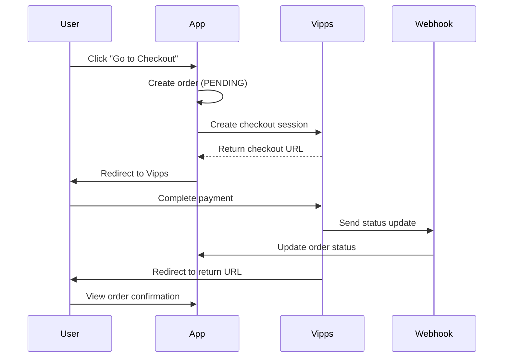

# `@repo/payment`

Payment processing package for the monorepo. Currently supports Vipps MobilePay Checkout.

## Features

- ✅ **Vipps Checkout Integration** - Full checkout flow with Vipps
- ✅ **Server Actions** - Easy-to-use actions for Next.js apps
- ✅ **Webhook Handling** - Automatic order status updates
- ✅ **Type-Safe** - Full TypeScript support
- ✅ **Error Handling** - Comprehensive error handling and logging
- ✅ **Status Verification** - Handles race conditions between webhooks and redirects
- ✅ **Framework-Agnostic** - Clean architecture with dependency injection
- ✅ **Testable** - Pure business logic, easy to mock and test

## Installation

This package is already part of the monorepo and available as `@repo/payment`.

## Quick Start

1. **Configure environment variables** (see `INTEGRATION.md`)
2. **Import in your app**:

```typescript
import { initiateVippsCheckout } from '@repo/payment/actions'
```

3. **Use in your cart page**:

```typescript
await initiateVippsCheckout({
  userId: 'user_123',
  items: cartItems,
  subtotal: 1000,
  total: 1000,
  currency: 'NOK',
})
```

## Documentation

- **[INTEGRATION.md](./INTEGRATION.md)** - Complete integration guide with examples
- **[vipps.ts](./vipps.ts)** - Core Vipps integration functions
- **[actions.ts](./actions.ts)** - Server actions for Next.js

## API

### Server Actions (Recommended)

#### `initiateVippsCheckout(params)`

Creates a checkout session and redirects user to Vipps.

#### `getOrder(orderId)`

Retrieves current order status from database.

#### `verifyOrder(orderId)`

Verifies order status with Vipps and updates database.

### Core Functions (Advanced)

These functions require passing a database client. Use server actions instead for convenience.

#### `createCheckoutSession(params, db)`

Creates a Vipps checkout session and returns the checkout URL.

#### `handleVippsCallback(authToken, sessionId, db)`

Processes webhook callbacks from Vipps.

#### `getOrderStatus(orderId, db)`

Retrieves current order status from database.

#### `verifyOrderStatus(orderId, db)`

Verifies order status with Vipps and updates database.

## Payment Flow



## Order States

| State | Description |
|-------|-------------|
| `pending` | Order created, payment initiated |
| `authorized` | User approved, money reserved |
| `paid` | Payment captured, money transferred |
| `cancelled` | User cancelled or payment expired |
| `failed` | Technical failure |

## Testing

Set `VIPPS_TEST_MODE=true` for test environment. See [INTEGRATION.md](./INTEGRATION.md) for testing details.

## Support

For questions or issues, refer to:
- [Vipps Developer Portal](https://developer.vippsmobilepay.com/)
- [Integration Guide](./INTEGRATION.md)